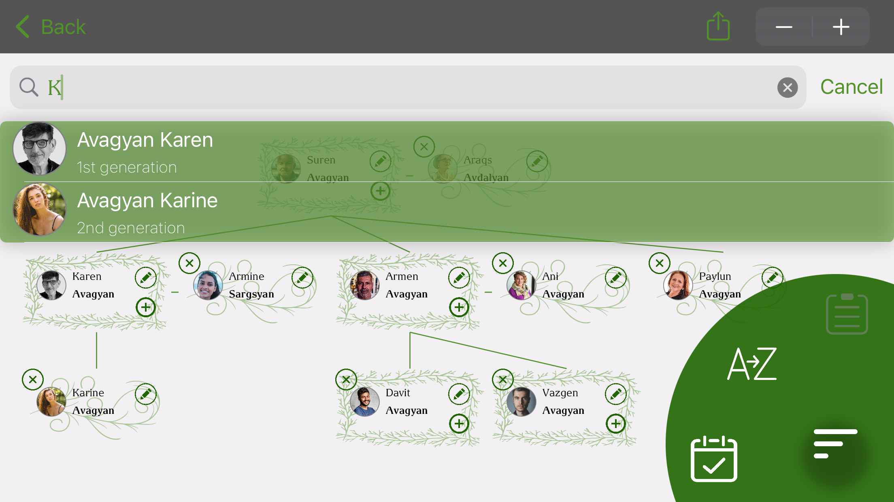

## Description

    

Create your family tree and share it with your loved ones. View, add and edit information about your family members.

This app helps to create a family tree diagram easily and quickly. You can also add facts and photos of your family members. This app works offline.

## Features

- Add/Edit/Delete facts
- Add/Edit/Delete photos
- Find person in the tree
- Works offline
- Share the tree via social network

### Support or Contact 

If you have any questions or suggestions about the app, do not hesitate to contact me at ani.avagyanv@gmail.com.
