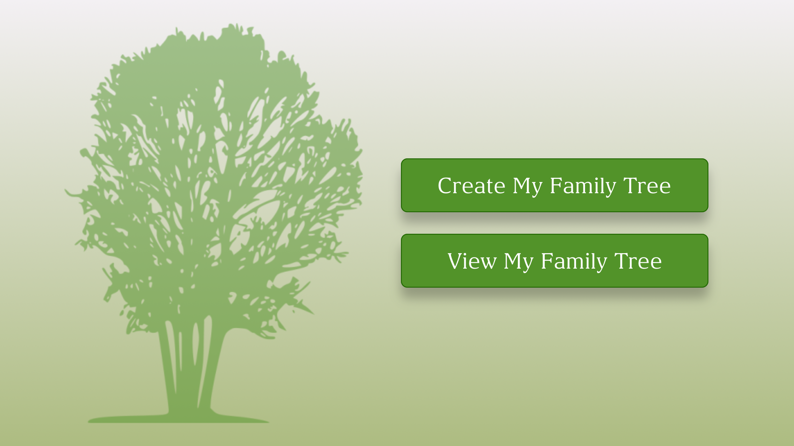

## Description

Create your family tree and share it with your loved ones. View, add and edit information about your family members.

This app helps to create a family tree diagram easily and quickly. You can also add facts and photos of your family members. This app works offline.



<div style="width: 1000px; height: 600px;">
    
</div>

<div>
    <p style="float: left;"></p>
    <p>Create your family tree and share it with your loved ones. View, add and edit information about your family members.<br/>This app helps to create a family tree diagram easily and quickly. You can also add facts and photos of your family members. This app works offline.</p>
</div>
<div style="clear: left;">
    <p style="float: left;"></p>
    <p>Create your family tree and share it with your loved ones. View, add and edit information about your family members.<br/>This app helps to create a family tree diagram easily and quickly. You can also add facts and photos of your family members. This app works offline.</p>
</div>

## Features

- Add/Edit/Delete facts
- Add/Edit/Delete photos
- Find person in the tree
- Works offline
- Share the tree via social network

## Welcome to GitHub Pages 123

You can use the [editor on GitHub](https://github.com/aniavagyanv/My-Family-Tree-Creator/edit/main/README.md) to maintain and preview the content for your website in Markdown files.

Whenever you commit to this repository, GitHub Pages will run [Jekyll](https://jekyllrb.com/) to rebuild the pages in your site, from the content in your Markdown files.

### Markdown

Markdown is a lightweight and easy-to-use syntax for styling your writing. It includes conventions for

```markdown
Syntax highlighted code block

# Header 1
## Header 2
### Header 3

- Bulleted
- List

1. Numbered
2. List

**Bold** and _Italic_ and `Code` text

[Link](url) and 
```

For more details see [GitHub Flavored Markdown](https://guides.github.com/features/mastering-markdown/).

### Jekyll Themes

Your Pages site will use the layout and styles from the Jekyll theme you have selected in your [repository settings](https://github.com/aniavagyanv/My-Family-Tree-Creator/settings). The name of this theme is saved in the Jekyll `_config.yml` configuration file.

### Support or Contact  

Having trouble with Pages? Check out our [documentation](https://docs.github.com/categories/github-pages-basics/) or [contact support](https://support.github.com/contact) and we’ll help you sort it out.
